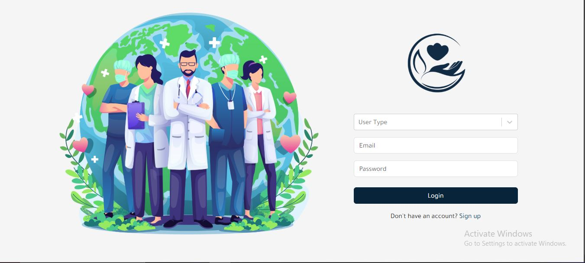
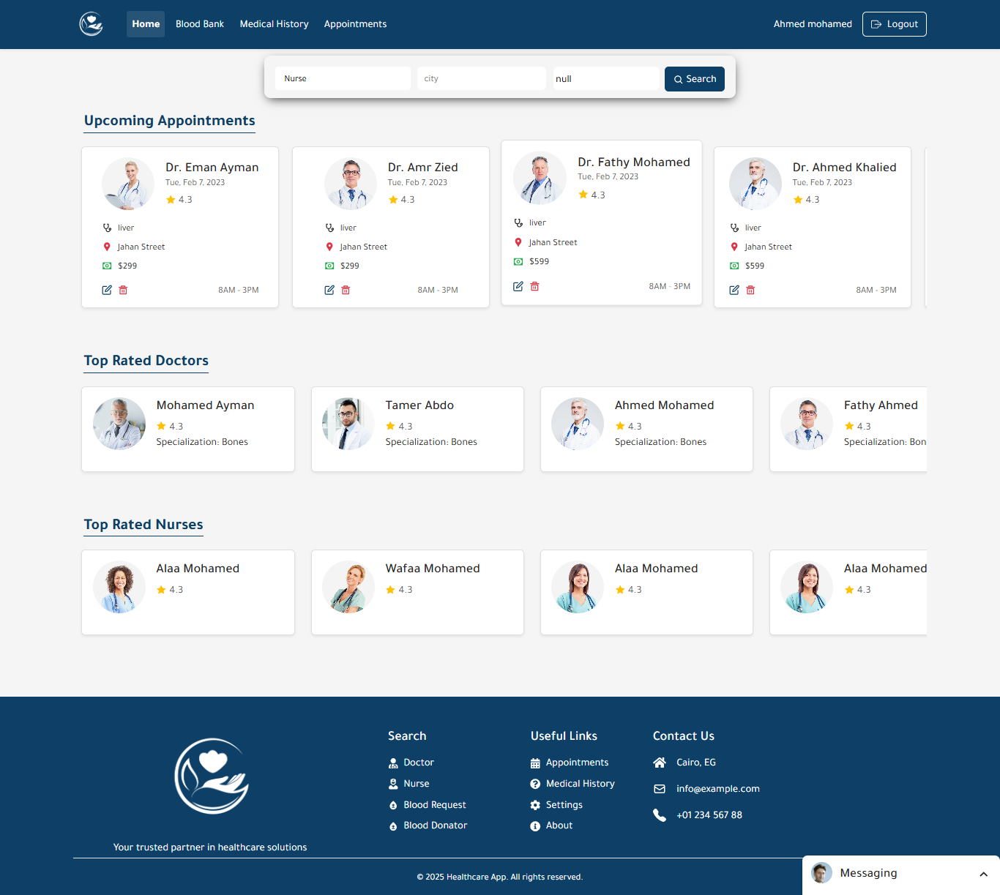
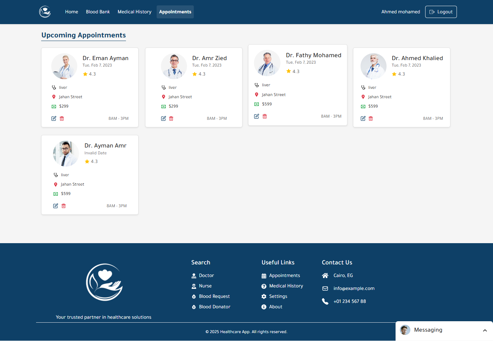
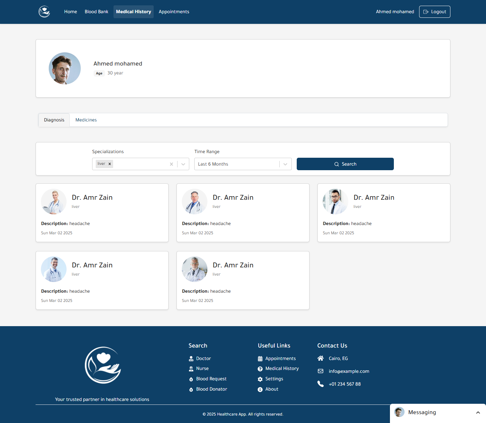
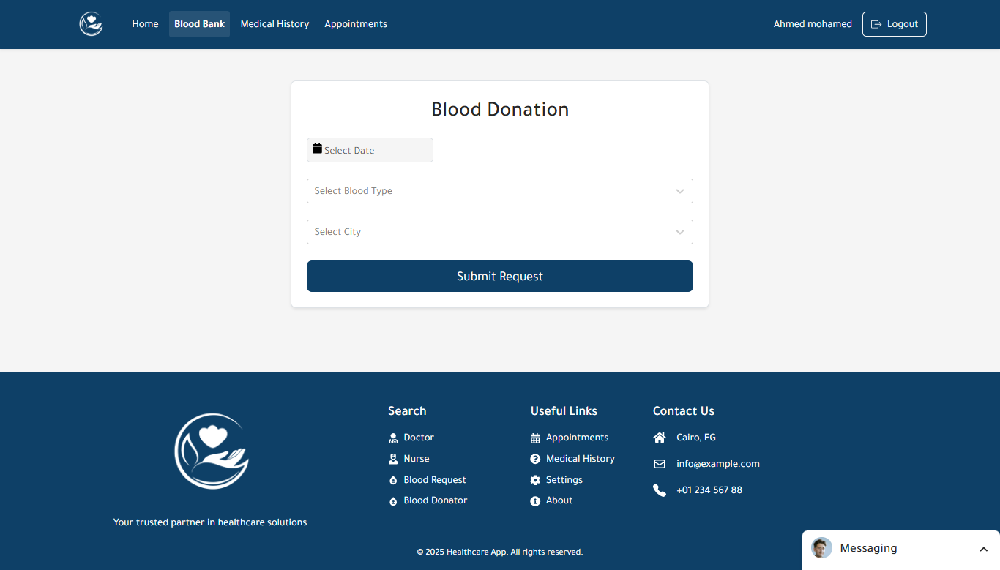
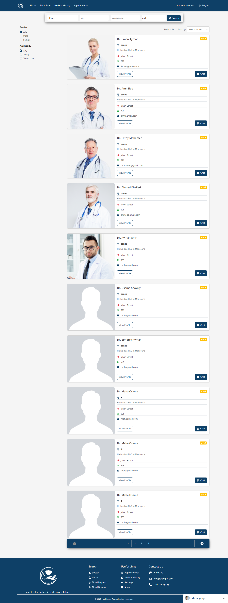
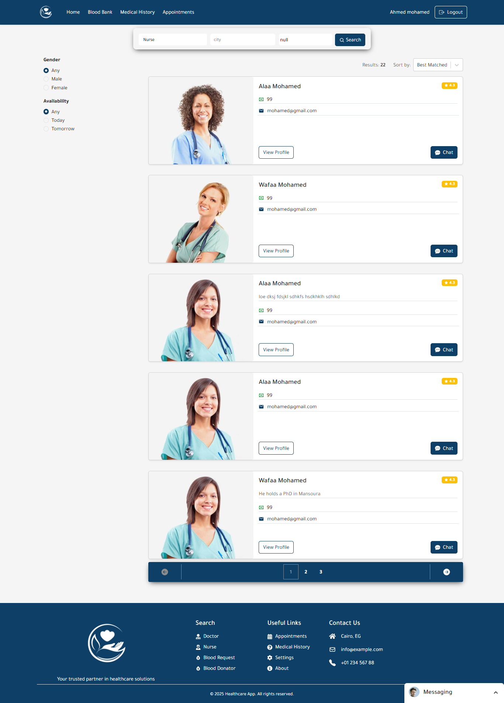
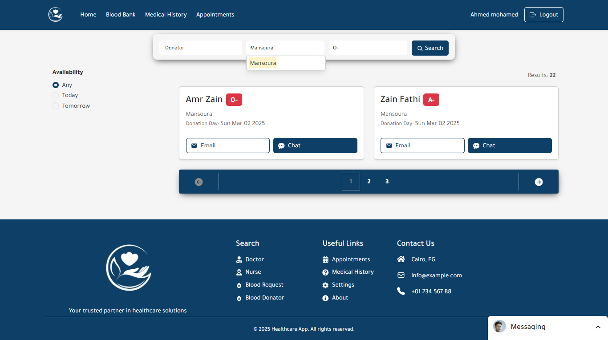

# care-track 
## Demo

## Description
The Healthcare Management System is a modern web application designed to enhance healthcare services through efficient scheduling, seamless management of patient medical records, and a platform for blood donation tracking. Built using React, Redux Toolkit, and Bootstrap, this application aims to improve the accessibility and effectiveness of healthcare for both patients and medical professionals.

## Key Features

* **Appointment Booking:**
    * Patients can easily schedule appointments with doctors or nurses through a user-friendly interface.
    * The system allows medical professionals to manage their availability, helping to reduce scheduling conflicts and improve patient access.
* **Patient Medical History Management:**
    * This feature allows healthcare providers to store and retrieve detailed patient records.
    * It ensures a comprehensive view of each patient's medical history, enabling doctors and nurses to make informed decisions for better care.
* **Blood Donation Platform:**
    * It also encourages community participation and raises awareness about the importance of blood donations.

## Technologies in frontend

* **React:** A JavaScript library for building dynamic user interfaces, providing a responsive and interactive experience.
* **Redux Toolkit:** A powerful toolset for managing state efficiently across the app, ensuring smooth data flow for appointments, patient records, and blood donation events.
* **Bootstrap:** A front-end framework that provides pre-designed components and ensures the app is visually appealing and responsive across devices.
* **Bootstrap:** A front-end framework that provides pre-designed components and ensures the app is visually appealing and responsive across devices.
* **React Hook Form:** For streamlined and efficient form management.
* **React Icons:** For easy inclusion of scalable vector icons.
* **and more**

##/front-end
 * `/public` - Static files (index.html, images, etc.)
* `/src` - Main source code
    * `/components` - Reusable UI components
    * `/features` - Redux slices for state management
    * `/pages` - Application pages
        * `patient` (Appionts, PatientHistory, etc.)
        * `doctor-nurse`
    * `/style` - Application styles
    * `/api` - API calls and external integrations
    * `/App.js` - Root component
    * `/index.js` - Entry point for React app
* `/node_modules` - Installed packages
* `package.json` - Project metadata and dependencies
* `.gitignore` - Git ignore file

## UI Screenshots
* all the screenshots are in the front-end/public/screenshots 

  
### Login

### Main Dashboard

This is the main dashboard, providing an overview of upcoming appointments, and quick access to patient records.

### Appointments

Patients can easily see appointments with doctors or nurses through this intuitive interface.

### Patient Medical Records

Healthcare providers can access and manage detailed patient medical records.

### Blood Donation Platform

### Search Platform Doctor

### Search Platform Nurse

### Search Platform Blood Donor

